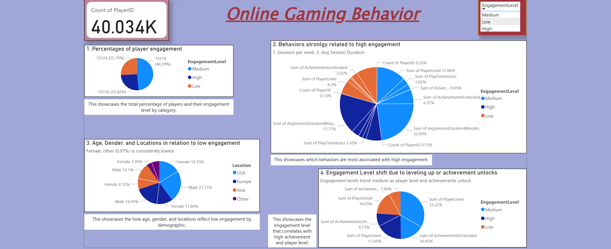
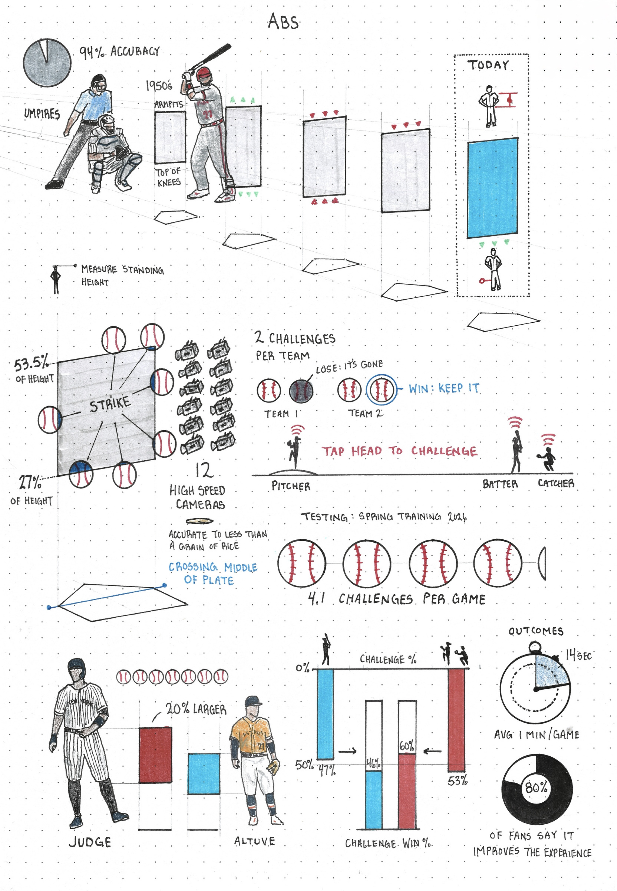

# 📊 Power BI Projects

Welcome! This repository highlights data visualization of raw data into meaningful insights via Power BI projects.

# Projects

## 🎮 Online Gaming Behavior
[onlinegamingbehavior.pbix] (onlinegamingbehavior.png)

> *"Just as we exercise great care about what we take into our bodies through our mouths, we should exert a similar vigilance about what we take into our minds through our eyes and ears." — Elder Joseph B. Wirthlin*

- Neatly showcases online gaming behavior from Steam to form key insights into how certain behaviors arise via differences and combinations via total player count, location, age, sex, engagement levels, sessions per week, session duration, player levels, and achievements to unlock. The key tool to discern each data point is choice of engagement level between low, medium, and high.
- A snapshot is given to demonstrate percentages of player engagement and how viewing each engagement level changes in each catergory analyzed as determinant behavior.
- Questions explored are which two behaviors are strongly linked to high engagement levels, which demographic best represents the lowest engagement level based on age, sex and location (interactible can be cycled through within Power BI between heirarchies), which engagement levels correlate with high achievement count and player levels.

## ⚾ Baseball, The Case for ABS vs. Umpires in the Attack Zones (in development...)

> "Let the robots take our jobs, and let them help us dream up new work that matters." — Kevin Kelly*

- Argues for the eventual replacement of all umpires in the MLB and or NCAA with nuanced data to support it
- Data points include...
    - Correct vs. incorrect calls within the defined AZ
    - MLB umpire scorecard on correct vs. incorrect strikes and balls in the 2022 season
    - Correlation between nuanced calls within the contested AZ areas (Not all pitches thrown in the rule-book strike zone are called for strikes -- and not all pitches thrown outside of the rule-book strike zone are called balls)
- Aforementioned data will compare against ABS data and take into account nuanced strike zone areas
- Umpire unions are another thing altogether to consider (but we don't touch on that here)

🤖 ABS Contextual Graphic
MLB introduced the Automated Ball-Strike (ABS) Challenge System powered by T-Mobile beginning with the 2026 season. The system will rely on the same Hawk-Eye tracking technology that fuels MLB's Statcast data.

Top Left of Graphic:
- The Strike Zone hasn't been the same forever. It has been consistently the width of home plate (even today) but... since the 1950's the height was estaablished as the armpits till top of the knees. Since then it has expanded and shrunk till... 
- ⚠️ Strike Zone today (2026) is defined by the top being the midpoint between the shoulders and the pants down to the bottom just below the kneecap.
- Umpires are right ~94% of the time.

 Middle Left of Graphic:
  - For this to be possible, you need a more accurate strike zone (more than just knees and shoulders). All players standing height were measured leadding to...
  - Bottom of strike zone and top of strike zone is 27% and 53.5% of player total height for every player. This does not come without discrepancy.
  - ⚠️ Pitching is judged as it crosses the midpoint of the plate... thus, every player has a slightly differnt zone (discrepancy).

 Bottom Left of Graphic:
  - Jose Altuve (Astros, blue), one of the shortest players in the league (5'6")
  - Aaron Judge (Yankees, red), one of the tallest players in the league (6'7")
  - 20% larger strike zone than Altuve = 7 more baseballs worth of space

 Middle to Bottom Right of Graphic:
 - Spring training analytics:
   - 4.1 challenges per game
   - 47% from batters (blue), 46% correct rate (note: batters don't have the same straight on view, expected)
   - 53% from pitchers and catchers (red), 60% correct rate (expected)
- Outcomes:
   - Each review takes 14 seconds, on average adds 1 minute per game
   - 80% fans say it improves the game experience
  

🧢 What to know about the ABS challenge system and how it works:
- Only batters and pitchers/catchers may initiate a challenge by tapping their cap within 2 seconds of the pitch sequence end. Managers, coaches and other players may not be involved.
- Each team starts the game with two challenges. Teams will lose the ability to challenge after they do so incorrectly twice. Teams will start each extra inning with a challenge regardless of whether they have already exhausted their challenges in the first nine innings.
- The ABS zone is set as follows: The width is 17 inches, identical to home plate. The top of the zone is set at 53.5% of a player's measured height without cleats. The bottom is set at 27% of the player's measured height. The strike zone is captured as the ball passes through the middle of the plate, not the front.
- In MLB, challenges will not be permitted when a position player is pitching.
- This is all possible by 12 high speed cameras around the stadium, tracking each pitch down the width of a grain of rice (if the ball grazes the edge of the AZ, it will recognize it as a strike). ⚠️ This is where AZ nuance is important and the aforementioned data before the graphic matters.
- This system has been in place for years in the Minor Leagues and during Spring Training

# ❓ About Power BI

Power BI is a business analytics service by Microsoft. It provides interactive visualizations and business intelligence capabilities with an interface simple enough for end users to create their own reports and dashboards; bringing raw data to life.

# 👨🏻‍💻 How to Use
1. Download and install Microsoft [Power BI Desktop](https://www.microsoft.com/en-us/download/details.aspx?id=58494) or alternatively, on your favorite browser, just [click this link](https://app.powerbi.com/singleSignOn?ru=https%3A%2F%2Fapp.powerbi.com%2F%3FnoSignUpCheck%3D1). You may be prompted to enter your Power BI account credentials
2. Dowload the .pbix file for any project
3. Open the file in Power BI to interact with the visualizations
4. Bridge your own data sources to create a custom dashboard and or add to the existing dashboard
